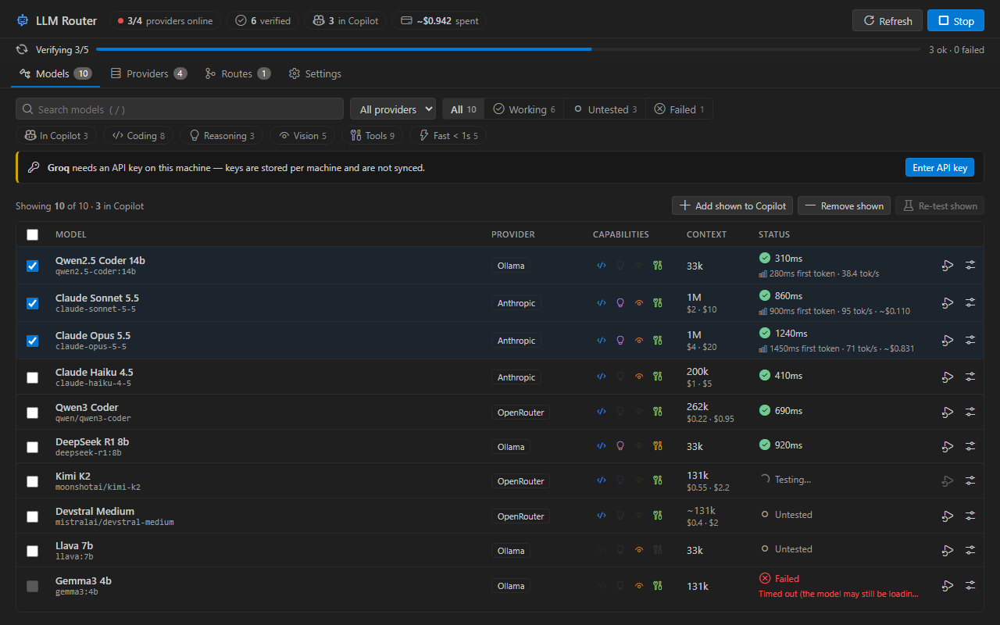
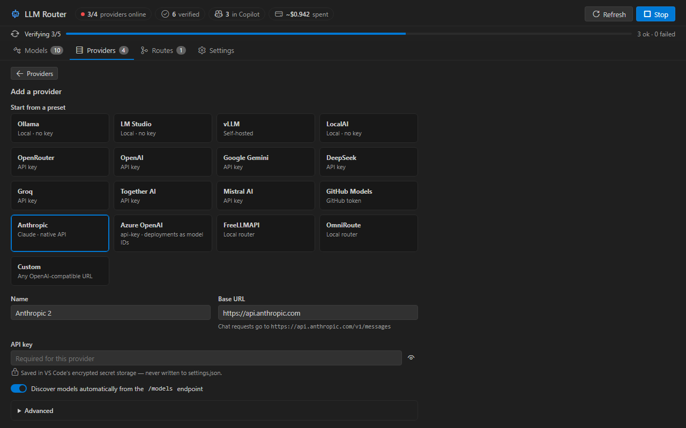

# Custom LLM Router for VS Code

[](https://github.com/aravind9643/vscode-custom-llm-router/actions/workflows/ci.yml)
[](https://code.visualstudio.com/)
[](https://code.visualstudio.com/api/extension-guides/ai/language-model-chat-provider)

Use **local and third-party models in GitHub Copilot Chat**. Custom LLM Router registers Anthropic (Claude), Azure OpenAI, Ollama, LM Studio, vLLM, LocalAI, OpenRouter, OpenAI, Gemini, DeepSeek, Groq, Together, Mistral, GitHub Models, FreeLLMAPI, OmniRoute, or any OpenAI-compatible server as a native VS Code language model provider. You get streaming, tool calling (agent mode), image input and reasoning output.



## Features

- **Native in Copilot**: the models you pick appear in the Copilot Chat model picker under *Custom LLM Router*.
- **Three wire protocols**:
  - **OpenAI-compatible**: most servers.
  - **Ollama native** (`/api/chat`): sends the context length (`num_ctx`) so long chats aren't cut short, plus keep-alive and native thinking.
  - **Anthropic Messages API**: uses the official SDK, with model limits from the Models API, summarized adaptive thinking, and refusal fallbacks on supported models.
- **Fallback routes**: combine several models into one picker entry. If the first is down, rate-limited or errors before answering, the next one takes over (for example, a local model first and a cloud model as backup).
- **Health-checked**: each model gets a quick chat check. With the full check it is also asked to call a tool, and the result is shown as *calls tools*, *accepts tools but ignores them*, or *no tool support*. Broken models never reach the picker.
- **Accurate limits**: real context windows are read from Ollama (`/api/show`) and LM Studio. You can override the name, context window, max output, tool support and image input for any model, and guessed values are marked `~`.
- **Cost-aware**:
  - Before checking many models on remote (possibly paid) providers, it asks first and offers to check only your selected models. A *basic* mode halves the number of requests.
  - Bulk checks are rate-limited per provider.
  - Prices come from OpenRouter or Anthropic's list prices and can be overridden per model. Spend is estimated from reported usage.
- **Real performance stats**: time to first token and tokens per second, measured from your actual chats. They stay on your machine.
- **Calibrated token counts**: learned from the usage numbers the server reports, so Copilot trims context at the right point.
- **Ollama extras**: pull models from the dashboard or sidebar, and keep models loaded with a per-provider keep-alive.
- **Secure keys**: API keys and credential-like header values live in VS Code's encrypted secret storage, never in `settings.json`. Keys are stored per machine, so when a provider rejects the credentials on a new machine you're asked to enter the key there.
- **Sidebar and dashboard**: an Activity Bar view with each provider's health and per-model checkboxes, plus a dashboard for searching and filtering models, bulk actions, routes and settings. It handles thousands of models without slowing down.

## Getting started

1. Install the `.vsix`:
   ```bash
   code --install-extension vscode-custom-llm-router-2.2.0.vsix --force
   ```
2. Open the **LLM Router** view in the Activity Bar and click **Add Provider**.
3. Pick a preset (or *Custom*), enter the API key if needed, then click **Test connection** and **Add provider**.
4. Click **Verify untested** to health-check the discovered models.
5. Tick the models you want, or create a **Route**, then select it in the Copilot Chat model picker.

### Base URLs

The `/v1` suffix is optional. The editor shows the exact chat URL it will call.

| Provider | Base URL |
|---|---|
| Ollama | `http://localhost:11434` |
| LM Studio | `http://localhost:1234` |
| vLLM | `http://localhost:8000` |
| OpenRouter | `https://openrouter.ai/api` |
| Groq | `https://api.groq.com/openai/v1` |
| Gemini | `https://generativelanguage.googleapis.com/v1beta/openai` |
| Anthropic | `https://api.anthropic.com` (Anthropic API) |
| Azure OpenAI | `https://<resource>.openai.azure.com/openai/v1`, key sent as `api-key`; add deployment names as manual model IDs |

Under *Advanced* you can set:
- the API type and how the key is sent
- overrides for the chat and models URLs
- extra headers (credential-like values are stored securely)
- a timeout
- the Ollama context length and keep-alive
- model IDs for servers that don't list their models

> **Ollama context:** with the default *Ollama native* API, models are loaded with the provider's context length (default 32k, capped at the model's maximum). Raise it if you have the memory; Copilot's limits follow it. If you switch an Ollama provider to the OpenAI-compatible API, Ollama uses `OLLAMA_CONTEXT_LENGTH` instead (often 4k–8k).



## Settings

| Setting | Default | Description |
|---|---|---|
| `customLlmRouter.providers` | `[]` | Providers (name, endpointUrl, headers, overrides, keepAlive, staticModels, …) |
| `customLlmRouter.copilotModels` | `[]` | Models shown in Copilot, as `Provider::modelId` |
| `customLlmRouter.routes` | `[]` | `{ name, models: ["Provider::modelId", …] }`, tried in order |
| `customLlmRouter.modelOverrides` | `{}` | Per-model `name`, `contextWindow`, `maxOutputTokens`, `toolCalling`, `vision` |
| `customLlmRouter.toolCheck` | `full` | `full` = chat + tool call (2 requests per model), `basic` = chat only |
| `customLlmRouter.testConcurrency` | `8` | Models verified in parallel |
| `customLlmRouter.providerConcurrency` | `3` | Parallel checks against one remote provider |
| `customLlmRouter.cacheTtlHours` | `48` | How long verification results are kept |
| `customLlmRouter.showReasoning` | `true` | Render reasoning output above answers |

## Commands

| Command | What it does |
|---|---|
| **LLM Router: Open Dashboard** | Models, providers, routes and settings |
| **LLM Router: Add Provider** | Provider editor with presets |
| **LLM Router: Refresh Models** | Re-fetches every provider's model list |
| **LLM Router: Verify Untested Models** | Health-checks models without a fresh result (asks first for large remote runs) |
| **LLM Router: Clear Verification Results** | Forgets results and re-checks the selected models |
| **LLM Router: Export / Import Configuration…** | Providers, selection, routes and overrides (keys are never exported) |
| **LLM Router: Show Logs** | Discovery, verification, route fallbacks and chat errors |

Right-click a provider in the sidebar to set its API key, test it, re-test its models, pull an Ollama model, edit, enable or disable, or delete it. Right-click a model to re-test it or edit its limits.

## Troubleshooting

- **"API key needed on this machine":** API keys and secret headers are kept in each machine's secret storage and are not part of Settings Sync. Use **Set API Key…** (sidebar, dashboard or the notification).
- **Anthropic refusals:** if Claude declines a request you'll see the refusal category. On api.anthropic.com, Claude Fable 5.1, Opus 5.5, Opus 5 and Sonnet 5.5 use server-side refusal fallbacks (`fallbacks: "default"`).
- **Corporate proxy:** requests use VS Code's `http.proxy` settings as long as `http.fetchAdditionalSupport` is enabled (the default). The extension warns you if a proxy is set but that option is off.
- **A model is missing from the picker:** it must be ticked (or part of a route) *and* have passed verification. Hover it in the sidebar to see why.
- **Reasoning display:** VS Code's native "thinking" UI is still a proposed API that Marketplace extensions can't use. Reasoning is shown as a quoted block instead, and that block is stripped from history so it isn't sent back to the model.

## Upgrading

**From 2.1:** no action needed. Ollama providers now use Ollama's native API by default; set *API type* to *OpenAI-compatible* to keep the old behavior.

**From 2.0:** no action needed. Routes, overrides, and the Ollama and LM Studio limits are new. Tool support is re-classified the next time a model is checked.

**From 1.x:**
- Copilot selection is now **opt-in**. Your previously active models are carried over automatically.
- Profiles were removed. Use the filters, bulk **Add shown to Copilot**, or routes instead.
- Model IDs are now `provider/model`, so you may need to re-pick your model in the chat picker once.

## Development

```bash
npm install
npm test                    # type-check + unit tests against the mock server + sidebar + dashboard (jsdom) tests
npm run test:integration    # launches a real VS Code with the extension and checks vscode.lm end to end
npm run bundle              # esbuild → dist/extension.js and media/dashboard.js (from src/webview/dashboard.ts)
npm run screenshots         # renders the dashboard in Dark/Light/High Contrast into test/visual/out (needs: npx playwright install chromium)
npm run l10n:export         # refresh l10n/bundle.l10n.json after changing user-facing strings
npx @vscode/vsce package --no-dependencies
```

Press **F5** and choose *Run Extension (with mock server)* to try everything offline. `mock_llm_server.py` (port 31415) imitates:
- streaming, reasoning and `<think>` tags
- tool calls and usage reporting
- the Ollama and Anthropic APIs
- auth-protected paths
- slow and failing models
