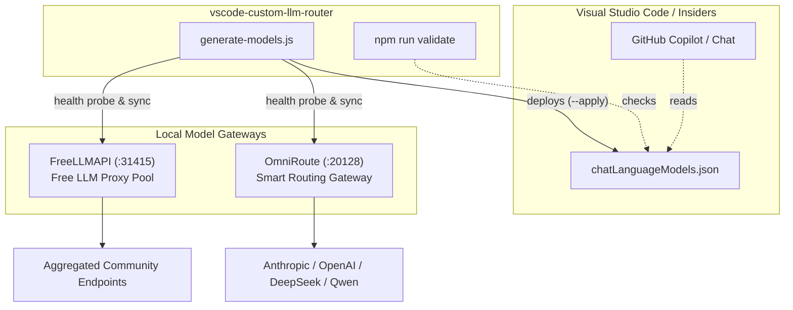

# vscode-custom-llm-router

[](LICENSE)
[](https://code.visualstudio.com/insiders/)
[](https://nodejs.org/)
[](https://github.com/aravind9643/vscode-custom-llm-router/actions)

Unified generator and validator for configuring local custom language model endpoints in Visual Studio Code (Copilot / Chat), adhering to the [VS Code Language Models custom endpoint specification](https://code.visualstudio.com/docs/agent-customization/language-models).

---

## 🏛️ Architecture Overview



---

## ⚡ Key Features

- **Single Orchestrator**: [generate-models.js](file:///d:/VSCodeCustomEndpointModels/generate-models.js) queries and integrates both FreeLLMAPI and OmniRoute.
- **Pre-flight Status Check (`npm run status`)**: Real-time probe of whether FreeLLMAPI & OmniRoute are online.
- **Automated Validation (`npm run validate`)**: Verifies `chatLanguageModels.json` against VS Code's official schema specifications.
- **Interactive Profile Menu (`npm run menu`)**: Quick visual selector for all models, coding only, top tier, or custom pick.
- **Environment Bootstrapper (`npm run init`)**: Auto-generates `.env` with unique cryptographic VS Code secret handles.
- **Prettified Model Names**: Cleans upstream routing tags (`ddgw/`, `no-think/`, etc.) into clean titles (e.g. `OmniRoute Best Coding`, `Claude 3.7 Sonnet (Fast/Direct)`).
- **Smart Token & Context Bounds**: Accurately infers `contextWindow` and token limits based on model architectures.
- **Direct VS Code Insiders Deployment (`--apply`)**: Writes directly to `Code - Insiders\User\chatLanguageModels.json` without modifying `settings.json`.
- **Background Sync Service**: Windows Task Scheduler script (`npm run service:install`) to sync every hour silently.

---

### 0. Quickstart One-Liner (Windows PowerShell)
```powershell
powershell -ExecutionPolicy Bypass -File .\install.ps1
```

### 1. Initialize & Check Status
```bash
# Initialize .env with random secret placeholders
npm run init

# Check connection to FreeLLMAPI and OmniRoute
npm run status
```

### 2. Interactive Menu or Direct Deployment
```bash
# Launch interactive profile menu (All, Coding, Top, or Custom):
npm run menu

# Or deploy presets directly to VS Code Insiders:
npm run apply           # All active models
npm run apply:coding    # Curated coding models
npm run apply:top       # Top-tier models
```

### 3. Validation, Benchmarks & Rules
```bash
# Validate chatLanguageModels.json against VS Code schema
npm run validate

# Run live benchmarks and generate BENCHMARKS.md leaderboard
npm run benchmark

# Configure blacklist/whitelist patterns in models.config.json
```

### 4. Background Sync Service (Windows Scheduled Task)
```bash
# Register automatic 1-hour background sync
npm run service:install

# Unregister scheduled task
npm run service:uninstall
```
